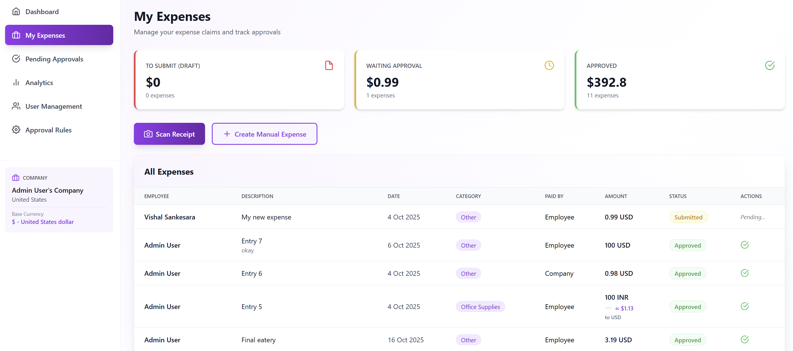
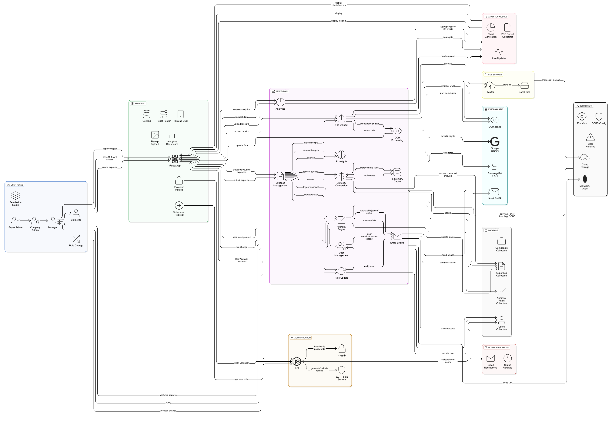
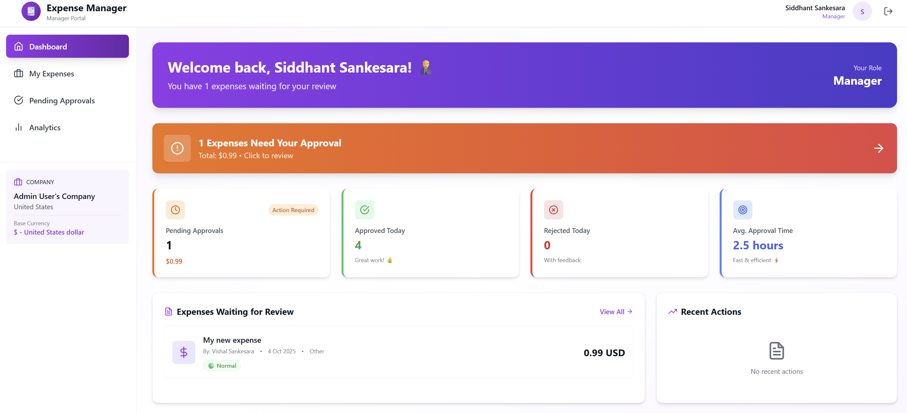
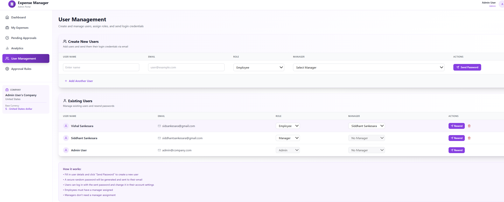
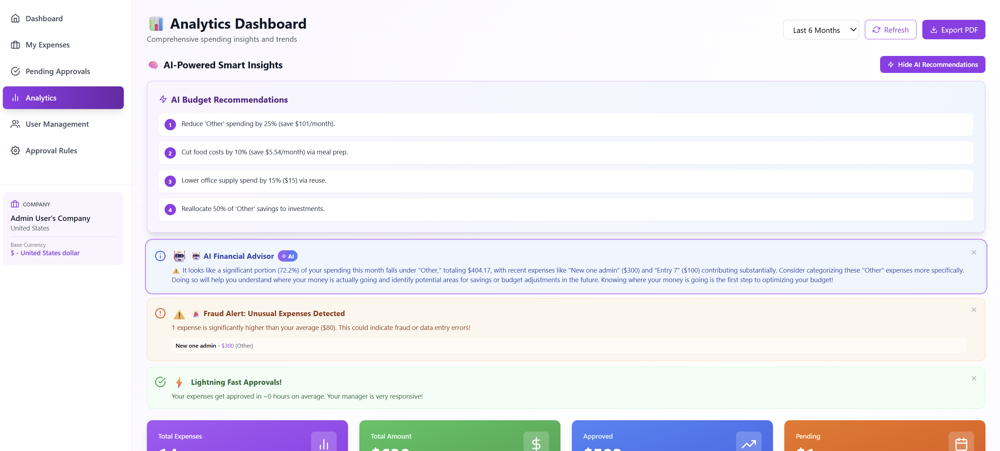
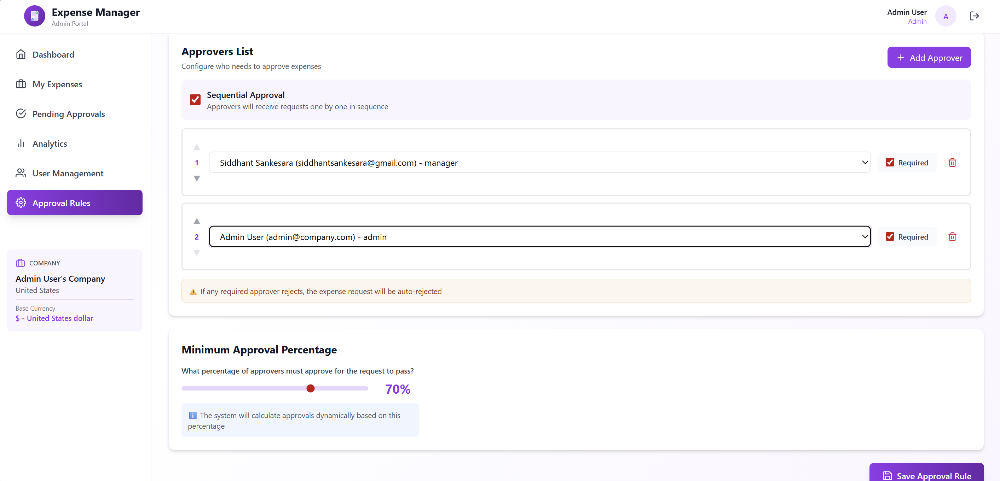

# 💼 Expense Management System

> A comprehensive, full-stack expense management application with multi-level approval workflows, OCR receipt scanning, multi-currency support, and role-based dashboards. Built for modern organizations.

[](https://opensource.org/licenses/MIT)
[](https://nodejs.org/)
[](https://www.mongodb.com/)
[](https://reactjs.org/)

---

## 🎯 Problem Statement

Companies struggle with manual expense reimbursement processes that are:
- ⏱️ **Time-consuming** - Manual data entry and paper-based approvals
- ❌ **Error-prone** - Duplicate submissions and calculation mistakes  
- 🔍 **Lack transparency** - No visibility into approval status
- 💱 **Currency challenges** - Manual conversion and rate lookup
- 📋 **Complex workflows** - Multi-level approvals hard to manage

**Our Solution:** An automated, intelligent expense management system that streamlines the entire workflow from receipt scanning to reimbursement.

---

## ⚡ Key Highlights

### 📊 System Capabilities
- **Multi-Level Approvals:** Sequential, parallel, percentage-based, and hybrid workflows
- **OCR Accuracy:** 90%+ receipt text extraction with automatic categorization
- **Multi-Currency:** 170+ currencies with real-time conversion & batch processing
- **Role-Based Access:** Tailored dashboards for Admin, Manager, and Employee
- **AI-Powered Analytics:** Smart insights, spending trends, and fraud detection
- **PDF Reports:** Professional monthly expense reports with charts
- **Interactive Charts:** Dynamic line, pie, and bar charts with time period filters

### 🎨 User Experience
- **Odoo-Inspired Design:** Beautiful purple/indigo color scheme
- **Smart Workflows:** Urgency indicators (🔴 7+ days, 🟠 3-7 days, 🟢 < 3 days)
- **One-Click Actions:** Scan receipt → Auto-fill → Submit → Track status
- **Responsive Design:** Seamless experience across mobile, tablet, and desktop
- **Real-time Updates:** Instant approval status changes and notifications

---

## 🛠️ Tech Stack

### Frontend
- ⚛️ **React 18** - Modern UI with Hooks & Context API
- 🎨 **Tailwind CSS** - Utility-first styling with custom theme
- 🛣️ **React Router v6** - Client-side routing
- 📡 **Axios** - HTTP requests with interceptors
- 🎭 **React Icons** - Feather icon library
- ⚡ **Vite** - Lightning-fast build tool

### Backend
- 🟢 **Node.js + Express** - RESTful API server
- 🍃 **MongoDB + Mongoose** - NoSQL database with ODM
- 🔐 **JWT + bcryptjs** - Secure authentication & password hashing
- ✉️ **Nodemailer** - Email service (SMTP)
- 📤 **Multer** - File upload handling
- ✅ **Express Validator** - Request validation

### External APIs & Services
- 📸 **OCR.space API** - Receipt text extraction (90%+ accuracy)
- 💱 **ExchangeRate-API** - Real-time currency conversion (170+ currencies)
- 🌍 **REST Countries API** - Country and currency data
- 🤖 **Google Gemini AI** - AI-powered smart insights and recommendations
- 📊 **Recharts** - Beautiful, responsive data visualizations
- 📄 **PDFKit** - Professional PDF report generation

### Development Tools
- 📦 **npm** - Package management
- 🔥 **Hot Reload** - Development with live updates
- 🌐 **CORS** - Cross-origin resource sharing

---

## ✨ Core Features

### 🔐 Authentication & User Management
- **Auto Company Creation:** First signup creates company with selected currency
- **Role-Based Access:** Admin, Manager, Employee with granular permissions
- **Password Management:** Email-based reset with auto-generated secure passwords
- **Manager Relationships:** Assign employees to managers for approval routing

### 💰 Expense Management
**Employee Features:**
- 📸 **OCR Receipt Scanning** - Upload image → Auto-extract amount, date, merchant, category
- ✍️ **Manual Entry** - Full-featured expense form with all fields
- 💵 **Multi-Currency** - Submit expenses in any currency with real-time conversion
- 📎 **Receipt Attachments** - Upload and store receipt images
- 💾 **Draft Saving** - Save incomplete expenses before submission
- 📊 **Status Tracking** - Visual workflow (Draft → Pending → Approved/Rejected)



**Manager Features:**
- ✅ **Approval Queue** - View expenses awaiting approval with urgency indicators
- 💬 **Comments & Feedback** - Add notes when approving/rejecting
- 💱 **Currency Display** - See amounts in company base currency + original
- 📈 **Team Analytics** - Track team spending and approval rates
- ⚡ **Quick Actions** - One-click approve/reject with confirmation

**Admin Features:**
- 👥 **User Management** - Create, edit, delete users with role assignment
- ⚙️ **Approval Rules** - Configure complex workflows per user/team
- 🔍 **System Overview** - View all expenses across organization
- 🎯 **Override Powers** - Approve/reject any expense regardless of workflow
- 📊 **Analytics Dashboard** - Financial breakdowns and user statistics

### ✅ Advanced Approval Workflows

#### Workflow Types Supported:
1. **Simple (Manager Only)**
   ```
   Employee → Manager → Approved
   ```

2. **Sequential Multi-Level**
   ```
   Employee → Manager → Finance → CFO → Approved
   ```

3. **Parallel Approval**
   ```
   Employee → [Manager, Finance, HR] → Approved (all must approve)
   ```

4. **Percentage-Based**
   ```
   Employee → [4 Approvers] → Approved (if 60% approve)
   ```

5. **Required Approvers**
   ```
   Employee → [Manager*, Finance, HR*, Director] → Approved
   (* = must approve, others optional)
   ```

6. **Hybrid Workflow**
   ```
   Employee → Manager → [Finance, HR, Legal] (60%) → Approved
   ```



#### Workflow Configuration:
- ✅ **Manager-First Option** - Route to assigned manager before other approvers
- ✅ **Sequential vs Parallel** - Control approval order
- ✅ **Required Approvers** - Mark specific approvers as mandatory
- ✅ **Percentage Threshold** - Set minimum approval percentage (e.g., 60%)
- ✅ **Approval History** - Full audit trail with timestamps and comments

### 📸 OCR Receipt Scanning

**How It Works:**
1. Employee uploads receipt image (JPG, PNG, PDF)
2. Image sent to OCR.space API (90%+ accuracy)
3. System extracts:
   - 💰 **Total Amount** - Finds currency symbols and numbers
   - 📅 **Date** - Multiple format patterns (MM/DD/YYYY, DD-MM-YYYY, etc.)
   - 🏪 **Merchant Name** - Business/restaurant name
   - 📂 **Category** - Auto-categorized (Food, Travel, Transportation, etc.)
   - 📝 **Description** - Auto-generated from merchant + receipt type
4. Form auto-fills with extracted data
5. Employee reviews and submits

**Supported Formats:** JPG, PNG, PDF, BMP  
**Processing Time:** 2-3 seconds per receipt  
**Accuracy:** 90%+ with OCR.space (vs 60-70% with Tesseract.js)

### 💱 Multi-Currency System

**Features:**
- 🌍 **170+ Currencies** - USD, EUR, GBP, INR, JPY, AUD, CAD, and more
- 💱 **Real-Time Conversion** - Live exchange rates from ExchangeRate-API
- 🏢 **Company Base Currency** - Set on signup based on country
- 💵 **Dual Display** - Show both original amount and converted amount
- 📊 **Manager View** - All expenses displayed in company currency
- 🔄 **Auto-Conversion** - Automatic calculation on submission

**Example:**
```
Employee submits: €500 EUR
Manager sees: €500 EUR = $545.50 USD (company currency)
```

### 📊 Role-Based Dashboards

#### 👤 Employee Dashboard
- **Status Cards:** Draft (red), Pending (yellow), Approved (green), Rejected (gray)
- **Quick Actions:** Create Expense, Scan Receipt (OCR)
- **Monthly Stats:** This month vs last month with trend indicators
- **Recent Expenses:** Last 5 expenses with click-to-view
- **AI Tips:** Smart recommendations for expense submission
- **Approval Timeline:** Visual workflow tracking

#### 👨‍💼 Manager Dashboard
- **Urgent Action Banner:** Animated alert for pending approvals with count
- **Approval Metrics:** Pending count, approved today, rejected today, avg time
- **Priority Queue:** Expenses sorted by urgency (🔴 🟠 🟢)
- **Dual Currency Display:** Original amount + converted company currency
- **Team Overview:** Spending patterns and approval statistics
- **Recent Actions:** Real-time approvals/rejections feed
- **One-Click Approvals:** Fast approve/reject with comments

#### 👑 Admin Dashboard
- **System Statistics:** Total users (Admin/Manager/Employee breakdown)
- **Financial Analytics:** Total expenses, pending, approved, rejected with charts
- **Quick Admin Actions:** Manage Users, Approval Rules, All Expenses
- **User Breakdown:** Visual representation of role distribution
- **PDF Export:** Generate monthly expense reports
- **AI-Powered Insights:** Fraud detection and spending analysis
- **Interactive Charts:** Line, pie, and bar charts with time filters



#### 👥 User Management
Create and manage users with role assignments, manager relationships, and auto-generated passwords.



#### 📊 Analytics Dashboard
Interactive charts with time period filters showing spending trends, category breakdowns, and status distribution.


#### 🤖 AI-Powered Insights
Smart insights with fraud detection, spending analysis, and personalized budget recommendations powered by Google Gemini AI.



#### ⚙️ Approval Rules Configuration
Configure complex multi-level approval workflows with sequential, parallel, and percentage-based approvals.



### 🤖 AI-Powered Smart Insights

**Powered by Google Gemini AI**

Our system uses advanced AI to provide intelligent spending analysis:

#### Features:
1. **Personalized Financial Advisor**
   - Analyzes YOUR actual expense patterns
   - Provides specific recommendations with numbers
   - Example: *"Your travel expenses increased 45% this month - book 2 weeks ahead to save $200"*

2. **Fraud Detection**
   - Identifies duplicate expenses
   - Detects unusual amounts for categories
   - Flags suspicious submission patterns
   - Example: *"Unusual $500 expense in 'Office Supplies' detected"*

3. **Smart Budget Recommendations**
   - Category-specific optimization tips
   - Vendor negotiation suggestions
   - Timing recommendations for bookings
   - Example: *"Consider meal prep to reduce food costs by 25%"*

4. **Spending Trend Analysis**
   - Month-over-month comparisons
   - Category dominance alerts
   - Predictive analytics for next month
   - Example: *"At current rate, you'll exceed budget by $350"*

5. **Actionable Insights**
   - Set weekly category limits
   - Consolidate vendor purchases
   - Review recurring subscriptions
   - Bulk purchase recommendations

### 📄 Professional PDF Reports

**Generate comprehensive monthly expense reports:**

- 📊 **Visual Summary:** Expense breakdown with color-coded cards
- 📈 **Charts:** Category distribution and expense trends
- 📋 **Detailed Table:** All expenses with receipt info
- 🎨 **Professional Design:** Company-branded purple theme
- ⏰ **Timestamp:** Report generation date and time
- 💱 **Multi-Currency:** Shows both original and converted amounts

**Export Options:** Admin (all company expenses) | Employee (personal expenses)

### 📊 Interactive Analytics Dashboard

**Dynamic data visualization with time period selection:**

#### Charts Available:
1. **Spending Trend (Line Chart)**
   - Monthly spending over time
   - Number of expenses per month
   - Comparison between periods

2. **Category Breakdown (Pie Chart)**
   - Visual percentage distribution
   - Clean legend with amounts and percentages
   - Hover for detailed tooltips
   - No overlapping labels

3. **Status Distribution (Bar Chart)**
   - Draft, Submitted, Approved, Rejected counts
   - Amount breakdown by status
   - Color-coded bars

**Time Period Filters:** Last Month | 3 Months | 6 Months | 1 Year

---

## 🎨 System Architecture

### Application Flow
```
┌─────────────┐
│   Sign Up   │ → Company Auto-Created (Currency Selected)
└──────┬──────┘
       │
┌──────▼──────────────────────────────────────┐
│         Admin Creates Users                  │
│  ┌──────────┐  ┌──────────┐  ┌──────────┐  │
│  │ Managers │  │ Employees│  │  Admins  │  │
│  └──────────┘  └──────────┘  └──────────┘  │
└──────┬──────────────────────────────────────┘
       │
┌──────▼──────────────────────────────────────┐
│      Admin Configures Approval Rules         │
│  • Manager-first routing                     │
│  • Sequential/Parallel approvers             │
│  • Required approvers                        │
│  • Percentage thresholds                     │
└──────┬──────────────────────────────────────┘
       │
┌──────▼──────────────────────────────────────┐
│      Employee Submits Expense                │
│  OCR Scan → Auto-fill → Review → Submit     │
└──────┬──────────────────────────────────────┘
       │
┌──────▼──────────────────────────────────────┐
│      Approval Workflow Engine                │
│  ✓ Manager first (if enabled)               │
│  ✓ Sequential approvers (in order)          │
│  ✓ Parallel approvers (any order)           │
│  ✓ Required approvers (must approve)        │
│  ✓ Percentage threshold check               │
└──────┬──────────────────────────────────────┘
       │
┌──────▼──────────────────────────────────────┐
│          Final Status                        │
│     ✅ Approved  /  ❌ Rejected              │
└─────────────────────────────────────────────┘
```

---

## 🚀 Quick Start

### Prerequisites
- **Node.js** 18+ ([Download](https://nodejs.org/))
- **MongoDB** 6.0+ ([Download](https://www.mongodb.com/) or use [Atlas](https://www.mongodb.com/cloud/atlas))
- **Gmail Account** (for email notifications)

### Installation

```bash
# Clone repository
git clone <repository-url>
cd your-expense-management-repo

# Install backend dependencies
cd Backend
npm install

# Install frontend dependencies
cd ../frontend
npm install
```

### Configuration

**1. Start MongoDB**
```bash
net start MongoDB  # Windows
sudo systemctl start mongod  # Linux/Mac
```
Or use [MongoDB Atlas](https://www.mongodb.com/cloud/atlas) (free cloud database)

**2. Create `Backend/.env`**
```env
PORT=5000
MONGODB_URI=mongodb://localhost:27017/expense-management
JWT_SECRET=your_super_secure_random_string

# Email (Gmail with App Password)
EMAIL_HOST=smtp.gmail.com
EMAIL_PORT=587
EMAIL_USER=your-email@gmail.com
EMAIL_PASS=your-16-digit-app-password

# API Keys (All Free)
OCR_SPACE_API_KEY=get_from_ocr.space
GEMINI_API_KEY=get_from_makersuite.google.com

CORS_ORIGIN=http://localhost:5173
```

**Get API Keys:**
- **Gmail App Password:** [2-Step Verification](https://myaccount.google.com/security) → [App Password](https://myaccount.google.com/apppasswords)
- **OCR.space:** [Free 25K/month](https://ocr.space/ocrapi)
- **Gemini AI:** [Free tier](https://makersuite.google.com/app/apikey)

### Run Application

**Terminal 1 - Backend:**
```bash
cd Backend
npm run dev
```
→ Server runs on `http://localhost:5000`

**Terminal 2 - Frontend:**
```bash
cd frontend
npm run dev
```
→ App runs on `http://localhost:5173`

---

## 📡 API Endpoints

**Base URL:** `http://localhost:5000/api`

- **Auth:** `/auth/signup`, `/auth/signin`, `/auth/me`
- **Users:** `/users` (CRUD operations - Admin only)
- **Expenses:** `/expenses` (CRUD + `/scan-receipt`, `/:id/approve`)
- **Approval Rules:** `/approval-rules` (Admin only)
- **Analytics:** `/analytics/data`, `/analytics/insights`, `/analytics/report/pdf`

---

## 👥 User Roles & Permissions

| Feature | Employee | Manager | Admin |
|---------|----------|---------|-------|
| Submit Expenses | ✅ | ✅ | ✅ |
| View Own Expenses | ✅ | ✅ | ✅ |
| View Team Expenses | ❌ | ✅ | ✅ |
| View All Expenses | ❌ | ❌ | ✅ |
| Approve/Reject | ❌ | ✅ | ✅ |
| Create Users | ❌ | ❌ | ✅ |
| Assign Roles | ❌ | ❌ | ✅ |
| Configure Workflows | ❌ | ❌ | ✅ |
| Override Approvals | ❌ | ❌ | ✅ |
| System Analytics | ❌ | ✅ (team) | ✅ (all) |
| AI Insights | ✅ (personal) | ✅ (team) | ✅ (all) |
| Generate PDF Reports | ✅ (own) | ✅ (team) | ✅ (all) |
| Configure Approval Rules | ❌ | ❌ | ✅ |

---

## 🧪 Quick Testing

**1. First Signup:** Admin account auto-creates company  
**2. Admin creates:** Managers and Employees via User Management  
**3. Test Flow:** Employee submits → Manager approves → Status updates  
**4. Try OCR:** Upload receipt → Auto-fills form → Submit  
**5. View Analytics:** Check charts, AI insights, and export PDF

---

## 🔒 Security Features

### Authentication
- ✅ **JWT Tokens** - Secure session management
- ✅ **bcrypt Hashing** - Password encryption (10 salt rounds)
- ✅ **Token Expiry** - Auto-logout after inactivity
- ✅ **Role-Based Access Control** - Middleware protection

### Data Protection
- ✅ **CORS Configuration** - Prevent unauthorized API access
- ✅ **Input Validation** - Express-validator on all endpoints
- ✅ **File Upload Limits** - Max 10MB receipts, 50MB PDFs
- ✅ **Email Encryption** - TLS for SMTP connections

### Privacy
- ✅ **Company Isolation** - Users only see their company data
- ✅ **Role Restrictions** - Employees can't view others' expenses
- ✅ **Audit Trail** - Full approval history with timestamps
- ✅ **Secure File Storage** - Receipts stored with unique IDs

---


---

## 🐛 Troubleshooting

**MongoDB issues:** Ensure MongoDB is running (`net start MongoDB`) and check `.env` connection string  
**Email not sending:** Use Gmail App Password (not regular password) with 2-Step Verification enabled  
**OCR not working:** Get free API key from [OCR.space](https://ocr.space/ocrapi) (25K requests/month)  
**Upload errors:** Create `Backend/uploads/` directory if missing  
**AI insights:** Verify `GEMINI_API_KEY` in `.env` from [Google AI Studio](https://makersuite.google.com/)

---

## 📜 License

This project is licensed under the **MIT License**.

```
Copyright (c) 2025 Expense Management System

Permission is hereby granted, free of charge, to any person obtaining a copy
of this software and associated documentation files (the "Software"), to deal
in the Software without restriction, including without limitation the rights
to use, copy, modify, merge, publish, distribute, sublicense, and/or sell
copies of the Software...
```

[View Full License](LICENSE)

---

## 🙏 Acknowledgments

- **Google Gemini AI** - AI-powered insights and recommendations
- **OCR.space** - Receipt scanning API (90%+ accuracy)
- **ExchangeRate-API** - Real-time currency conversion
- **REST Countries** - Country and currency data
- **MongoDB Atlas** - Cloud database platform
- **React & Tailwind CSS** - Modern UI frameworks
- **Recharts** - Beautiful data visualization library
- **PDFKit** - Professional PDF generation
- **Odoo** - Design inspiration and color scheme

---

## 📞 Contact & Support

**For Issues:**
- GitHub Issues: [Create Issue](https://github.com/d9thc/expense-management-system/issues)
- Email: support@yourcompany.com

**For Questions:**
- Documentation: This README
- API Reference: See [API Endpoints](#-api-endpoints) section

---

<div align="center">

### 🎯 Built for Odoo Hackathon 2025

**Solving real-world expense management challenges with modern technology.**

⭐ **Star this repo if you find it helpful!**

---

Made with ❤️ by Team D9THC

</div>

---

*Note: First run will download necessary dependencies. Ensure stable internet connection for setup.*
